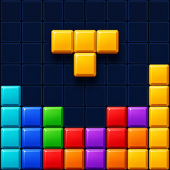
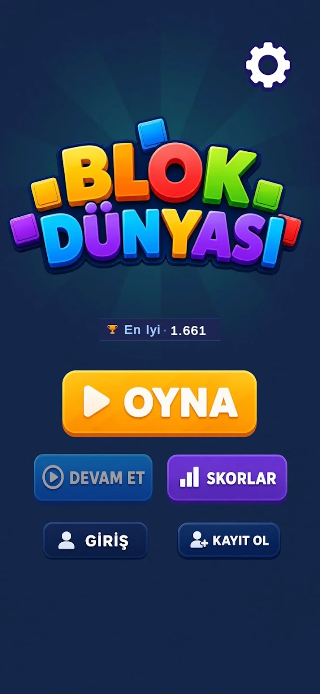
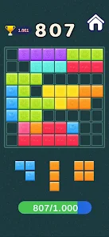
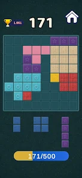
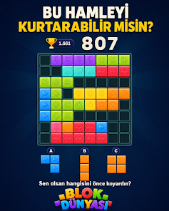
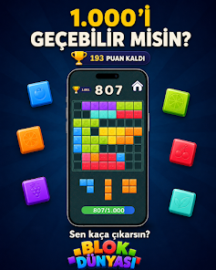
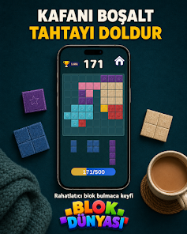

<div align="center">



# Blok Dünyası

### Bir hamle daha… Sonra bir rekor daha.

Bloklarını yerleştir, tahtayı temizle, komboyu büyüt ve kendi rekorunu geç. Blok Dünyası; kısa molaları heyecanlı bir mücadeleye dönüştüren mobil puzzle deneyimidir.

[](https://unity.com/)
[](https://learn.microsoft.com/dotnet/csharp/)
[](https://www.android.com/)
[](#lisans)

</div>

<p align="center">
  
</p>

## Oyun nedir?

Blok Dünyası’nda farklı şekillerdeki blokları 8×8 veya 10×10 oyun tahtasına yerleştir. Satır ve sütunları tamamla, tahtayı temizle, kombo zincirleri kur ve en yüksek skoru hedefle.

Kurallar kolay. Ustalaşması zor. En iyi skor tamamen senin planına bağlı.

### Neden tekrar tekrar oynayacaksın?

- **İlk hamlede öğren, yüzüncü hamlede ustalaş.** Basit kontroller, derin strateji.
- **Komboyu yakala.** Arka arkaya temizlemelerle skorunu katla.
- **Kendi rekoruna meydan oku.** Her oyun, geçilecek yeni bir hedef bırakır.
- **Kısa molalar için ideal.** Birkaç dakikada oynanır; kaldığın yerden devam eder.
- **Sakinleş veya yarış.** Rahatlatıcı bir bulmaca turu da mümkün, skor avı da.

## Oyuncu deneyimi

| 🧩 Stratejik puzzle | 🎨 Canlı temalar | 📈 İlerleme sistemi |
| --- | --- | --- |
| Farklı blok şekilleri ve iki tahta boyutu ile her tur yeni bir plan gerektirir. | Renkli blok setleri, ahşap tema ve özelleştirilebilir arayüz varlıkları. | Kombo, görev, ödül, skor geçmişi ve liderlik tablosu altyapısı. |

| 📱 Mobil kontrol | 💾 Güvenli kayıt | 🔒 Hazır servis katmanı |
| --- | --- | --- |
| Dokunmatik sürükle-bırak ve masaüstü test akışı. | En iyi skor, ayarlar ve oyun durumu için kalıcı kayıt. | AdMob, Firebase Analytics/Crashlytics ve Google Play Games entegrasyonları. |

## Bir sonraki hamlen hazır mı?

Tahtada boş bir alan var. Elindeki parçalar bekliyor. Şimdi oyna, ilk kombonu kur ve **“bir tur daha”** demenin neden bu kadar kolay olduğunu keşfet.

<p align="center">
  <strong>🟨 Yerleştir &nbsp; → &nbsp; 🟩 Temizle &nbsp; → &nbsp; 🟪 Komboyu büyüt &nbsp; → &nbsp; 🏆 Rekorunu kır</strong>
</p>

## Oyun içinden gerçek ekranlar

<p align="center">
  
  
  
  
  
</p>

Bu galeri, oyunun gerçek akışından alınmış mobil ekranları gösterir: ana menü, aktif tahta, skor hedefi ve farklı oyun modları. Yeni mağaza görselleri `StoreScreenshots/` altında tutulmalıdır.

## Proje mimarisi

```text
Assets/
├── Scenes/                 # MainMenu, OyunEkranı, Scores
├── Scripts/
│   ├── Core/               # Unity'den bağımsız oyun kuralları ve veri modelleri
│   ├── UnityAdapter/       # Oyun motoru, input, UI ve servis adaptörleri
│   ├── UI/                 # Reklam ve ortak UI bileşenleri
│   └── Systems/            # Uygulama yaşam döngüsü ve global servisler
├── Resources/              # Fontlar, UI kitleri ve runtime asset'leri
└── Images/                 # Temalar, arka planlar ve görsel içerik
```

Oyun kuralları `Core` içinde test edilebilir kalır; Unity’ye özel davranışlar `UnityAdapter` katmanında toplanır.

## Hızlı başlangıç

### Gereksinimler

- Unity 6
- Android Build Support (Android geliştiriyorsanız)
- Git LFS (büyük görsel ve font asset’leri için önerilir)

### Projeyi açma

1. Depoyu klonlayın.
2. Unity Hub’da bu repository kökünü seçin.
3. Unity’nin paketleri ve asset’leri import etmesini bekleyin.
4. `Assets/Scenes/MainMenu.unity` sahnesini açın.

```bash
git clone https://github.com/Krayirhan/BlokDunyasi.git
cd BlokDunyasi
```

### Production sahneleri

1. `Assets/Scenes/MainMenu.unity`
2. `Assets/Scenes/OyunEkranı.unity`
3. `Assets/Scenes/Scores.unity`

Sahne listesi için tek kaynak `ProjectSettings/EditorBuildSettings.asset` dosyasıdır.

## Test ve doğrulama

Core testlerini IDE veya Unity Test Runner üzerinden çalıştırabilirsiniz. Release öncesi:

```text
✓ MainMenu → OyunEkranı → Scores akışı çalışıyor
✓ 8×8 ve 10×10 tahta boyutları oynanabilir
✓ Kayıt/yükleme ve en yüksek skor tutarlı
✓ Reklam izinleri ve consent akışı test edildi
✓ Safe area farklı cihaz oranlarında doğrulandı
✓ Store build'de debug/per-frame loglar kapalı
```

Detaylı kontrol listeleri için [Docs/](Docs/) klasörüne bakın.

## Geliştirici rehberi

| Konu | Kaynak |
| --- | --- |
| UI sorumlulukları | [Docs/UIControllerResponsibilities.md](Docs/UIControllerResponsibilities.md) |
| İlerleme ve ödül sahipliği | [Docs/UIProgressRewardOwnership.md](Docs/UIProgressRewardOwnership.md) |
| Adapter bağımlılık grafiği | [Docs/AdapterDependencyGraph.md](Docs/AdapterDependencyGraph.md) |
| Safe area sözleşmesi | [Docs/SafeAreaContract.md](Docs/SafeAreaContract.md) |
| Gameplay layout otoritesi | [Docs/GameplayLayoutAuthority.md](Docs/GameplayLayoutAuthority.md) |
| Repository hijyeni | [Docs/RepoHygienePolicy.md](Docs/RepoHygienePolicy.md) |

## Katkı akışı

1. Yeni bir branch açın: `codex/<konu>` veya `feature/<konu>`.
2. Değişiklikleri küçük ve anlamlı commit’lere bölün.
3. Testleri çalıştırın ve `git status --short` çıktısını kontrol edin.
4. UI değişiklikleri için pull request’e ekran görüntüsü ekleyin.

## Lisans

Bu repository özel bir projedir. Kod, görseller, fontlar ve üçüncü taraf asset’ler için dağıtım veya yeniden kullanım hakları ayrıca kontrol edilmeden dışarı aktarılamaz.

<div align="center">

**Blok Dünyası** · Daha iyi hamle, daha yüksek skor.

</div>
